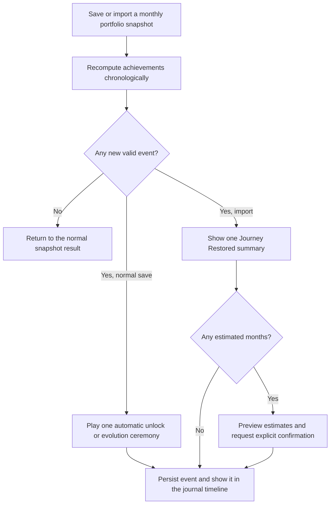

# Cairn Achievement System

Status: Approved product direction
Date: 2026-08-09
Scope: UX, achievement rules, visual language, motion, sharing, import, and implementation boundaries

## 1. Product intent

The achievement system exists to make long-term financial progress tangible. It is a private record of a family's financial journey, not a competition, trading incentive, or rewards program.

Principles:

- Private by default. No leaderboard, percentile, social comparison, or public profile.
- Commemorate facts without judging how money was earned or why a balance changed.
- Prefer a small number of meaningful, evolving artifacts over a large checklist.
- Never attach financial advice, yield claims, paid benefits, or functional privileges.
- Preserve the calm Cairn interface. Spectacle is reserved for the moment of achievement.
- Version 1 uses financial holdings only. Physical possessions do not participate.

## 2. Information architecture

Achievements do not become a fifth navigation destination.

### Dashboard entry

Add a compact achievement module inside the financial-wealth hero:

- latest unlocked achievement;
- title and earned month;
- compact evolving badge;
- a single `Open achievement journal` affordance;
- progress toward only the next visible wealth milestone.

The module must remain secondary to the financial total. When no achievement has been earned, it previews `First Stone` and explains how to begin.

### Achievement journal

Open as a pushed destination on compact devices and a detail destination or large sheet on macOS. It contains three layers:

1. **Featured artifact** — most recently earned, rarest, or currently evolving badge.
2. **Family tracks** — the three achievement families, their earned states, and only the next explicit threshold.
3. **Journey timeline** — a chronological record of every unlock and personal-record update.

Do not use a flat trophy grid as the primary structure.

### Locked content

- Show all earned stages.
- Show the next stage with its exact requirement.
- Show later stages only as silhouettes.
- Never add notification dots to pressure the user into opening the journal.

## 3. Core flow



Achievements unlock automatically. There is no claim button.

## 4. Achievement catalog

### 4.1 Prologue: First Stone

Chinese: `第一块基石`
English: `First Stone`

Award once after the first successfully captured monthly portfolio snapshot. It is a prologue, not a fourth family.

Purpose:

- prevents a completely empty journal for a new user;
- connects the product name to the monthly check-up habit;
- teaches the unlock ceremony at low intensity.

Visual: a single dark alpine stone with one teal seam of light.

### 4.2 Wealth Milestones

Chinese: `财富里程碑`
English: `Wealth Milestones`

Display helper: `Calculated from financial assets` / `按金融资产总额计算`

The source value is the frozen financial total from a monthly `PortfolioSnapshot`. Physical possessions are excluded.

Thresholds follow an unbounded `1–2–5` ladder:

```text
100k → 200k → 500k → 1m → 2m → 5m → 10m → 20m → 50m → 100m → …
```

Rules:

- Unlock only when the recorded financial total reaches or exceeds a threshold for the first time.
- A later decline never revokes an honestly earned achievement.
- Crossing the same threshold again does not unlock another badge.
- A factual data correction or deletion triggers full recomputation and may remove an invalid unlock.
- Each unlock stores its amount, home currency, logical achievement month, and actual unlock time.
- Existing stages remain earned when the home currency changes; an ordinal stage cannot be earned twice merely by switching currencies.

Naming can be evocative, but the amount remains the primary truth:

| Threshold | Chinese working title | English working title | Material |
| --- | --- | --- | --- |
| 100k | 初砺 | First Ascent | Alpine stone |
| 200k | 矿脉 | Vein Found | Bronze vein |
| 500k | 青峰 | Jade Ridge | Jade |
| 1m | 百万峰线 | Million Crest | Obsidian |
| 2m | 云上之门 | Above the Cloudline | Opal |
| 5m | 极光之巅 | Aurora Summit | Aurora crystal |
| 10m | 天际冠冕 | Horizon Crown | Crowned aurora crystal |

After the six base materials are exhausted, retain aurora crystal and add one, two, then five orbiting facets for each new order-of-magnitude ladder.

### 4.3 Monthly Ascent

Chinese: `月度跃升`
English: `Monthly Ascent`

This is one persistent artifact representing the largest positive month-over-month increase ever recorded for a currency.

Eligibility:

- exactly two adjacent calendar months;
- both months have explicit `PortfolioSnapshot` records;
- both records use the same home currency;
- `current.totalAmount - previous.totalAmount > 0`.

Behavior:

- the first eligible positive pair creates the initial record;
- every later personal best updates the same artifact;
- every personal best appears as a separate timeline event;
- negative or smaller changes do not lower the record;
- each home currency maintains an independent record;
- records from different currencies never compete through live FX conversion.

The exact record amount is engraved only in large presentations of the artifact. At small sizes it appears in adjacent copy to preserve legibility.

Major visual evolution occurs at:

```text
10k → 20k → 50k → 100k → 200k → 500k → 1m → 2m → 5m → …
```

Every new personal best receives a short evolution ceremony. Material changes only when a major threshold is crossed.

### 4.4 Time Marks

Chinese: `岁月刻度`
English: `Time Marks`

Award for the longest run of adjacent calendar months with captured portfolio snapshots:

```text
3 → 6 → 12 → 24 → 60 months
```

Rules:

- use the snapshot's logical month, not its creation date;
- a late backfill counts for the month it represents;
- imported explicit monthly snapshots count;
- a missing month resets the current streak;
- an earned badge and the historical longest streak remain permanently visible;
- a factual data correction may recompute the historical streak.

This family must avoid guilt language. Never say `You broke your streak`. Use `A new trail begins this month`.

## 5. Currency behavior

- Format all values with the snapshot's stored ISO currency and the active locale.
- Store the currency at unlock time; never render a historical amount using today's home currency.
- Wealth milestone stages are ordinal and global to the user. Currency switching cannot duplicate the same stage.
- Monthly Ascent records are currency-specific because absolute deltas are not comparable across currencies.
- Time Marks are currency-independent because they reward the existence of a monthly check-up, not its value.

## 6. Unlock ceremony

### Standard unlock

Duration: `1.8 seconds` before controls become primary.

1. **Compression, 0–220 ms** — the ambient field darkens slightly and the badge begins as a dense stone core.
2. **Fracture, 220–650 ms** — a thin teal seam splits the core; particles move outward along the family glyph.
3. **Forge, 650–1,250 ms** — the material resolves, the engraved line catches light, and the title fades in.
4. **Settle, 1,250–1,800 ms** — particles dissipate, the badge floats into a stable resting pose, and copy becomes fully readable.

Copy pattern:

```text
You reached a new height.
Financial assets crossed A$1,000,000 for the first time.
August 2026
```

Chinese:

```text
你抵达了新的高度。
金融资产总额首次越过 A$1,000,000。
2026 年 8 月
```

Controls:

- primary: `View in journal` / `查看纪念册`;
- secondary: `Create share card` / `生成分享卡`;
- closing the ceremony still persists the achievement automatically.

There is no sound. On supported devices, use restrained haptics at fracture and settle.

### Record evolution

Use a shorter `1.2 second` version. Morph the old engraved amount into the new amount and intensify the material only if a major Monthly Ascent threshold was crossed.

### Reduced motion

When Reduce Motion is active:

- replace scale, orbit, and particles with a 250 ms crossfade;
- use one static highlight sweep;
- preserve all copy and state changes;
- do not autoplay idle animation.

## 7. Import and historical reconstruction

After restore or import, replay eligible snapshots in chronological order and derive the original qualifying month for every event.

Do not play ceremonies sequentially. Show one `Your journey has been restored` summary:

- spotlight the three most meaningful recovered artifacts;
- group the remainder by family;
- list the recovered date range;
- provide a direct route to the journal.

Explicit frozen monthly totals can unlock automatically. If an older backup lacks monthly portfolio totals:

- reconstruction may be offered as an estimate;
- estimated months are visually labeled;
- show the proposed milestones before changing achievement state;
- require user confirmation before awarding any estimate-derived achievement;
- store that the event was confirmed from reconstructed history.

## 8. Corrections and recomputation

Market movement and data correction have different semantics:

- **Market decline:** keep every achievement.
- **Editing/deleting historical data:** replay the full deterministic engine.
- **Invalid event after replay:** remove it from the earned collection and timeline.
- **Record amount changes:** update Monthly Ascent to the new valid maximum.
- **Import replacing the store:** recompute from imported source data; do not merge stale derived state.

The achievement engine must be deterministic. Derived output should be reproducible from snapshots plus the stored user-confirmation flags for estimated history.

## 9. Badge visual system

### Anatomy

Every artifact has five layers:

1. **Stone seal silhouette** — a chamfered, slightly irregular cairn shape; never a generic circular medal.
2. **Family sculpture** — the central form that identifies the achievement without color.
3. **Threshold ring** — facets, cuts, or orbit count indicating progression.
4. **Material body** — stone, vein, jade, obsidian, opal, or aurora crystal.
5. **Aura** — effects shown only in featured, unlock, and share contexts.

### Family sculptures

| Family | Primary form | Motion signature |
| --- | --- | --- |
| Wealth Milestones | stacked stones resolving into a mountain peak | stones rise and lock into place |
| Monthly Ascent | a beam splitting and lifting a rock stratum | the seam travels upward and rewrites the record |
| Time Marks | concentric trail rings wrapping a cairn | one ring completes per earned stage |
| First Stone | one solitary stone with a lit seam | one soft pulse |

Do not depend on SF Symbols for the collectible artwork. SF Symbols remain appropriate for navigation and compact utility affordances.

### Material ladder

| Material | Surface behavior | Core colors |
| --- | --- | --- |
| Alpine stone | fine grain, carved edges, matte response | `#253F3C`, `#5D7772` |
| Bronze vein | dark stone with embedded warm metal | `#47382C`, `#C38B52` |
| Jade | translucent depth, cloudy inclusions | `#075F59`, `#55D4C6` |
| Obsidian | near-black glass with sharp teal fracture | `#071F1D`, `#2CCABD` |
| Opal | pale mineral with restrained spectral interference | `#D8F6EF`, `#8EC8D0`, `#D5B67A` |
| Aurora crystal | deep crystalline core with moving teal-violet caustics | `#062C2A`, `#42E2D0`, `#7559B9` |

Pink, orange, and purple may appear only as refracted highlights. Teal remains the brand anchor.

### Size behavior

- `40–56 pt`: silhouette and family sculpture only; no engraved number or aura.
- `72–96 pt`: add threshold ring and restrained material depth.
- `112–180 pt`: enable engraved amount, parallax, caustics, and aura.
- Share render: `1024 × 1024` source artwork with the same silhouette and lighting model.

### Idle behavior

- Collection rows are static.
- Only the featured artifact may use a 6–8 second specular drift and subtle pointer/gyroscope parallax.
- Pause effects when the window is inactive or the artifact is off-screen.
- Cap particles at 24 on macOS and 16 on iOS.

## 10. Share card

Sharing is always initiated by the user.

Default content:

- artifact artwork;
- achievement name;
- achieved month;
- neutral line such as `A new financial milestone`;
- small Cairn wordmark.

Hidden by default:

- exact achievement amount;
- current financial total;
- family member names;
- account and holding names;
- allocation or change data.

The user may explicitly enable the milestone amount. Do not offer current-total or member-data toggles.

Formats:

- square `1:1` for messages and feeds;
- portrait `9:16` for stories;
- both must keep all sensitive fields off unless deliberately enabled.

## 11. Accessibility

- Every artifact has a localized accessibility label containing family, stage, earned date, and amount when applicable.
- Shape and sculpture distinguish families and stages without relying on color.
- Text never sits over an animated or high-contrast region without a stable surface.
- Support Dynamic Type; move the featured artifact above copy at accessibility sizes.
- Meet WCAG AA contrast for text and controls.
- Respect Reduce Motion and Differentiate Without Color.
- Haptics are supplementary and never carry unique meaning.

## 12. Suggested persistence model

Keep definitions in code and persist earned facts separately.

```text
AchievementEvent
  id
  family                 // prologue, wealthMilestone, monthlyAscent, timeMark
  stageKey               // first-stone, wealth-1m, ascent-100k, time-12m
  logicalMonth           // normalized first day of month
  unlockedAt             // actual creation time
  currencyCode?          // required for amount-based events
  observedAmount?        // frozen qualifying amount or delta
  source                 // live, imported, confirmedEstimate
  sourceSnapshotIDs      // inputs used by the deterministic replay
  definitionVersion      // migration and auditability

AchievementRecord
  family
  currencyCode?
  currentStageKey
  bestAmount?
  bestMonth?
  longestRun?
  updatedAt
```

`AchievementEvent` is the auditable timeline. `AchievementRecord` is a recomputable read model used for fast UI rendering.

Add persisted achievement data to both the SwiftData schema and the `.cairn` backup payload. Increment the backup format version and keep decoding tolerant of older backups.

## 13. Evaluation checklist

The design is ready for implementation when all of the following hold:

- A new user sees First Stone after the first captured month.
- A wealth milestone unlocks exactly once per ordinal threshold.
- Adjacent-month validation prevents a multi-month gap from becoming a Monthly Ascent.
- Currency switching cannot compare incompatible Monthly Ascent amounts.
- Late backfill can repair a Time Marks streak.
- A market decline does not revoke an achievement.
- Editing bad source data deterministically removes invalid events.
- Import presents one batched ceremony, not a sequence of modals.
- Estimate-derived import events require confirmation.
- Dashboard remains financially legible with achievements disabled or empty.
- All screens work in English and Simplified Chinese.
- Reduce Motion produces a complete, non-animated experience.
- Sharing exposes no amount or identity by default.
